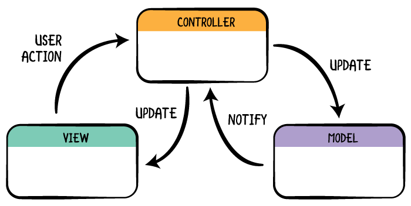
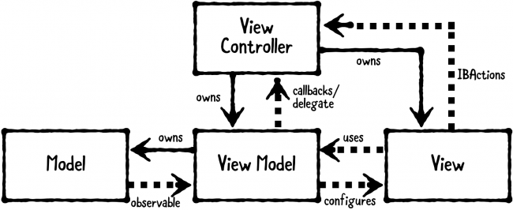

# App Architecture

## 1. MVC

MVC is a software development pattern made up of three main objects:

- The **Model** is where your data resides. Things like persistence, model objects, parsers, managers, and networking code live there.
- The **View** layer is the face of your app. Its classes are often reusable as they don’t contain any domain-specific logic. For example, a `UILabel` is a view that presents text on the screen, and it’s reusable and extensible.
- The **Controller** mediates between the view and the model via the delegation pattern. In an ideal scenario, the controller entity won’t know the concrete view it’s dealing with. Instead, it will communicate with an abstraction via a protocol. A classic example is the way a `UITableView` communicates with its data source via the `UITableViewDataSource` protocol.

Please follow [This Tutorial](https://www.raywenderlich.com/1000705-model-view-controller-mvc-in-ios-a-modern-approach) to learn MVC

## 2. MVVM

Model-View-ViewModel (MVVM) is a structural design pattern that separates objects into three distinct groups:

- **Models** hold application data. They’re usually structs or simple classes.
- **Views** display visual elements and controls on the screen. They’re typically subclasses of `UIView`.
- **View models** transform model information into values that can be displayed on a view. They’re usually classes, so they can be passed around as references.

Please follow [This Tutorial](https://www.raywenderlich.com/34-design-patterns-by-tutorials-mvvm) to learn MVVM, stop before **Tutorial Project**, finishing the **Playground Example** is enough.

## 3. Practice

Please use MVVM to refactor your POS project in **Basic M10**

