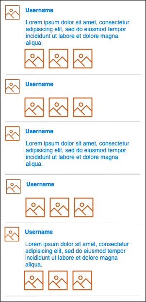

# Dynamic Content List

In our projects, we will found not every list has its items with same size, we usually face an issue which is the content of the cell is dynamic, depends on the content size of the item. Eg. Wechat/Facebook, in the list of the content, every cell has different size, this is called dynamic sizing cell/item or self sizing cell/item. Today we will focus on how to make your list dynamic.

## Required Knowledge

- UIKit
- UITableView
- UICollectionView(Optional)
- AutoLayout

Before learning the dynamic sizing list, you need to know how to create a tableview or collection and fillin the data with fixed list item size. And also need to know how to layout the UI elements.

## Dynamic content in UITableView

A few steps to build your dynamic content UITableView

1. Set the `estimatedRowHeight` of the `UITableView`, to the value called 

## Exercise: Wechat Moment

The following URL is for the list of wechat data. We need to make it displayed as a dynamic content list as following:

URL: https://emagrorrim.github.io/mock-api/moments.json

Screenshot:

We don't need you to write the list point by point, but we should try make it looks simular to the above mockup. So here are the `functional requirements`.

- The data in the moments.json, we can see they all contains some of the data. At least they should have username(Using nick name) and avatar in `sender`. We should just show what the json model contains. (eg. if the item only contains images and sender, the cell should looks like the row 2 and row 4, and if it only has text content, it should looks like the row 3.)
- We only show 3 images at most (contained in one line).
- We need to show the full text content.
- No need to filter any items in json file even it only has a sender.
- Ignore the comments field, it is for later sessions.

*The demo project already contains some code to help you fetch data from network and also it already has configuring network image api built.*
