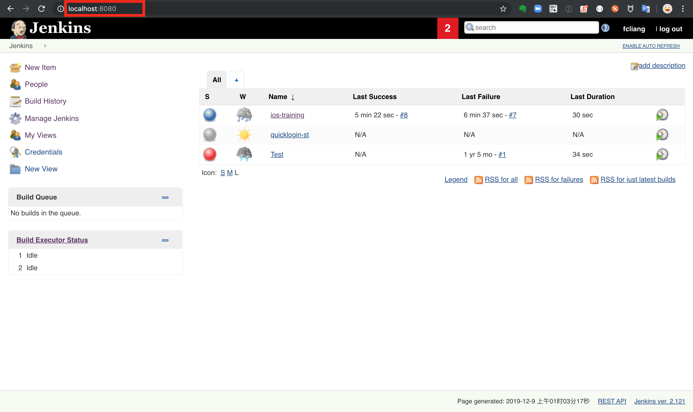
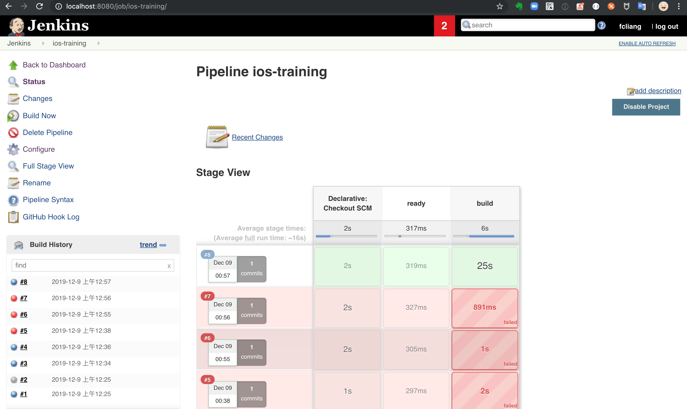

# Continuous Integration
Continuous Integration (CI) is a development practice that requires developers to integrate code into a shared repository several times a day. Each check-in is then verified by an automated build, allowing teams to detect problems early.
By integrating regularly, you can detect errors quickly, and locate them more easily.

## Jenkins
Jenkins is a CI tool.
### Install
`brew update`
`brew install jenkins`
### Run
`brew services start jenkins` 
Open brower and go to http://localhost:8080/

> stop
`brew services stop jenkins`
restart
`brew services restart jenkins`

### Creating your first Pipeline
[Creating your first Pipeline](https://jenkins.io/doc/book/pipeline/getting-started/)

## Exercise
1. Creating a pipeline to build iOS project. like this:

2. Add a webhook to the pipeline to make it trigger by git push.

## Further reading
[fastlane](https://docs.fastlane.tools/)
