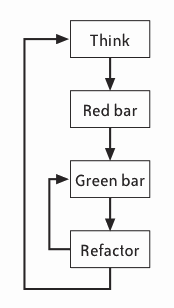

# Test Driven Development

Research shows that TDD substantially reduces the incidence of defects. When used properly, it also helps improve your design, documents your public interfaces, and guards against future mistakes.  
> [Intro to TDD from wikipedia](https://en.wikipedia.org/wiki/Test-driven_development)

## A TDD Tour

To use TDD, follow the "red, green, refactor" cycle illustrated in Figure. With experience, unless you're doing a lot of refactoring, each cycle will take fewer than five minutes. Repeat the cycle until your work is finished. You can stop and integrate whenever all your tests pass, which should be every few minutes.

[Detail](https://www.jamesshore.com/Agile-Book/test_driven_development.html)

## More

[Pair Programming](https://www.jamesshore.com/Agile-Book/pair_programming.html)  
[Refactoring](https://www.jamesshore.com/Agile-Book/refactoring.html)   
[Exploratory Testing](https://www.jamesshore.com/Agile-Book/exploratory_testing.html)