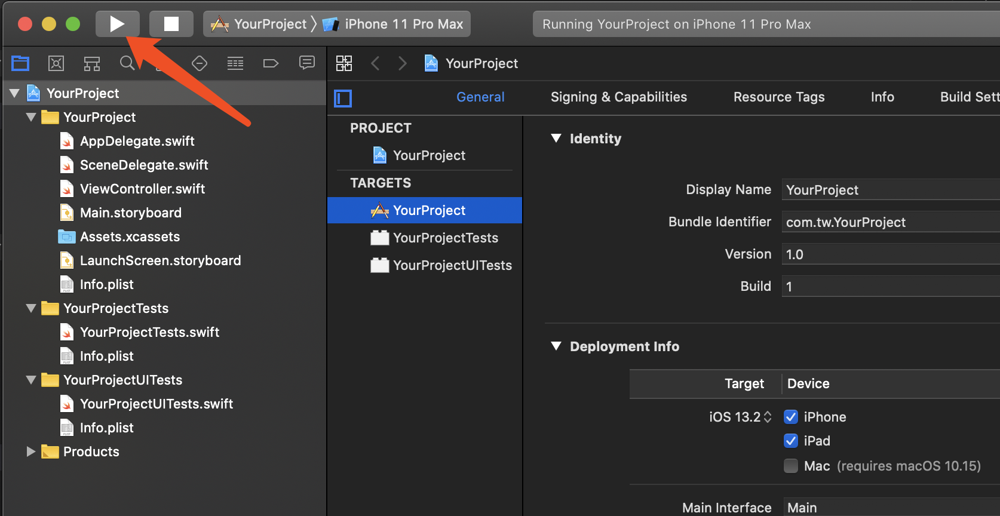
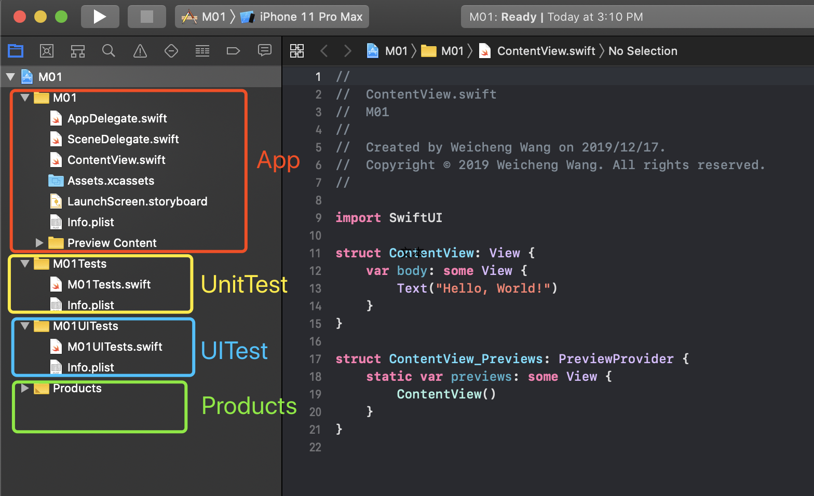
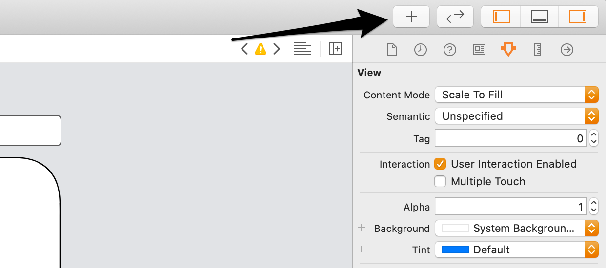
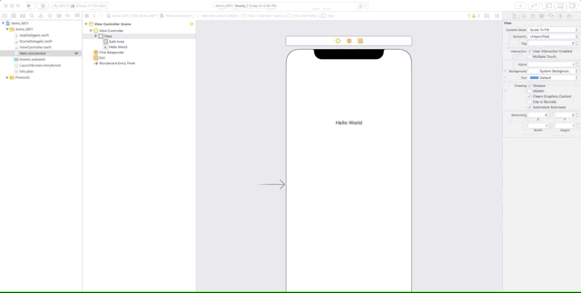
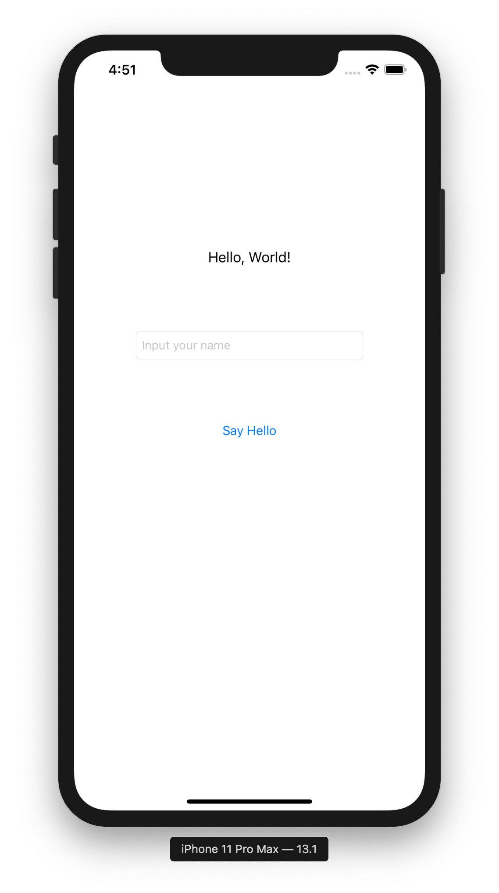
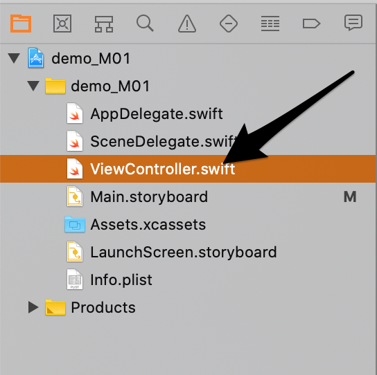
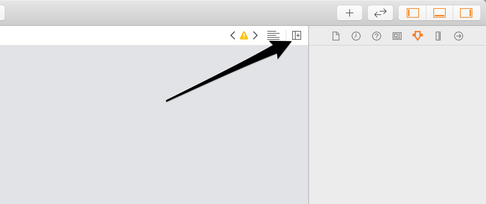
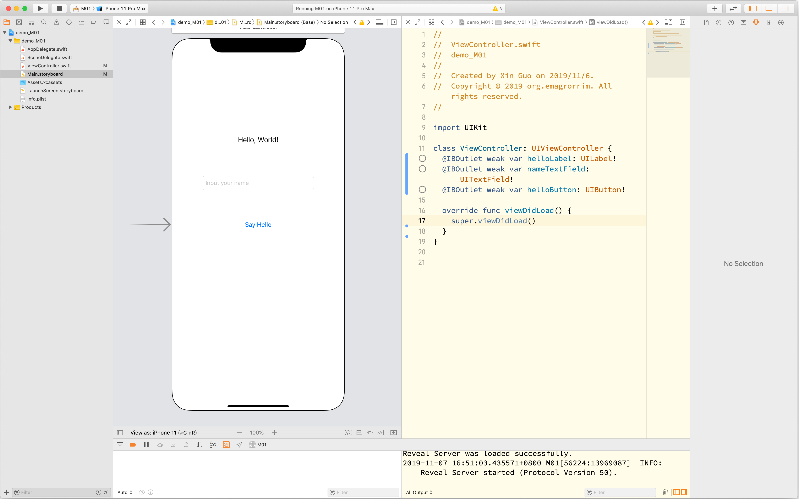

# Intro to Xcode

The Xcode provide everything you need to develop an iOS application.

In this session, We will understand the basic operation of xcode together.

## Create a new project

### Getting started with a new project

* Open Xcode, choose `Create a new Xcode project`
* Create a Single View App, as show below
* Give the project a name, organisation and check the unit tests box (more on this in another session)


### Run the app

* Using `CMD+R` to run the app or Click the button in following picture.



Then you should see simulator started and show a blank screen.

### The anatomy of an app

- an app is a bundle of compiled code (usually Swift), images and other resources
  - zipped up and deployed through the app store
- these bundles are represented by a target in Xcode

### Project structure

- Project Targets - App, Unit Tests, UI Tests targets and Products
- Folder structure - App, Unit Tests and UI Tests
- Schemes - a way to compile and run a target
- Run the app vs running the tests



### App lifecycle

- Breakpoints: Breakpoints and Check the stack trace in Xcode
- AppDelegate: Centre point for the app lifecycle
- UIViewController: Represents part of a screen

> UIViewController will appear frequently in your project, please pay attention to the life cycle of UIViewController

### More Xcode features

* Navigators (left panel) - different views on the your project, like files, issues, tests, breakpoints
* Inspectors (right panel): File Inspector, Help Inspector, more on Interface Builder session.
* Output (bottom panel) - see debug output and the actual debugger

<br />

> __Tips: Learn more about usage of Xcode. Click [here](https://help.apple.com/xcode/mac/current/#/devc8c2a6be1)__


### Interface Builder (IB)

- Apps by default are set up to use visual storyboards and interface builder files to construct the UI:
  - Main.storyboard: The default start UI
  - Info.plist (Main storyboard file base name): How to configure which storyboard to use for the initial UI
- UI created in Interface Builder (IB) can be linked to your code using special keywords and pre-defined relationships
  - `IBOutlet`: a marker that can bind a view element in IB to a variable in your code
  - `IBAction`: a marker that can bind an action (eg. button tap) from IB to the a function in your code that executes

## Exercise: Helloworld project

### Add some elements on to the screen

- Show some words (`UILabel`)
  - Click the following button to create UI elements.
  - Select the element you want.
  - Drag it to the position you want to put it.
  - Edit its attributes to make it looks like what we want. Change the text to `Hello, World!`.




- Input field (`UITextField`)
  - Same step to create a label, just select different type of UI element and drag to the view.
  - Set the placeholder to `Input your name`
- Button (`UIButton`)
  - Set the button title to `Say Hello`
- Run the app, you should see the following screen in simulator.



### Link up UI elements between code and IB



Add `IBOutlet` and UI elements properties in the `ViewController` in above file.

```swift
@IBOutlet weak var helloLabel: UILabel!
@IBOutlet weak var nameTextField: UITextField!
@IBOutlet weak var helloButton: UIButton!
```

Then click the following button, and you should see two code panel and then you can connect the code and UI elements in IB by draging.





### Write the logic code

- Update the label to `Hello, $your_name` when you click the say hello button using the name in the text field.

## What's next?

Though the next modules, we'll learn about most of the elements of the demo search property listings app:

- Enough of the Swift languge to get you going
- Using UIKit and Auto Layout to build the UI for the app
- Retrieving data from the network
- Displaying listings in a scrolling table
- Testing and debugging your application
- Submitting the app to the store

## Further reading

- Apple's documentation https://developer.apple.com/library/archive/documentation/ToolsLanguages/Conceptual/Xcode_Overview/
- Shortcuts https://swifteducation.github.io/assets/pdfs/XcodeKeyboardShortcuts.pdf
- Ray Wenderlich Tutorials, eg. Your First iOS App
- A large list of iOS learning resources and blogs: https://github.com/sanketfirodiya/iOS-learning-resources
