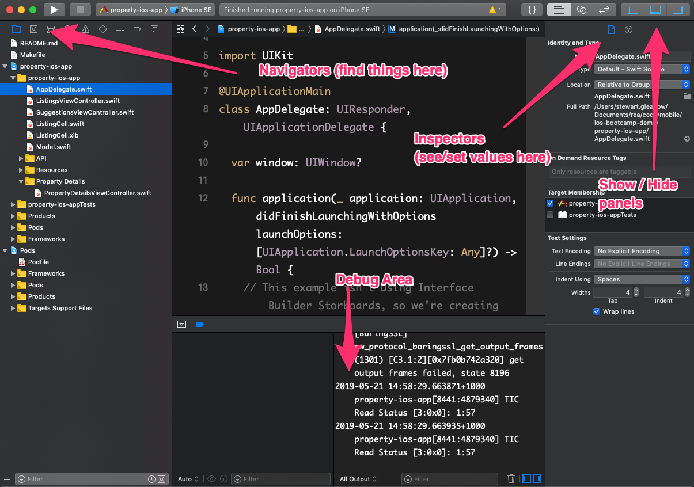
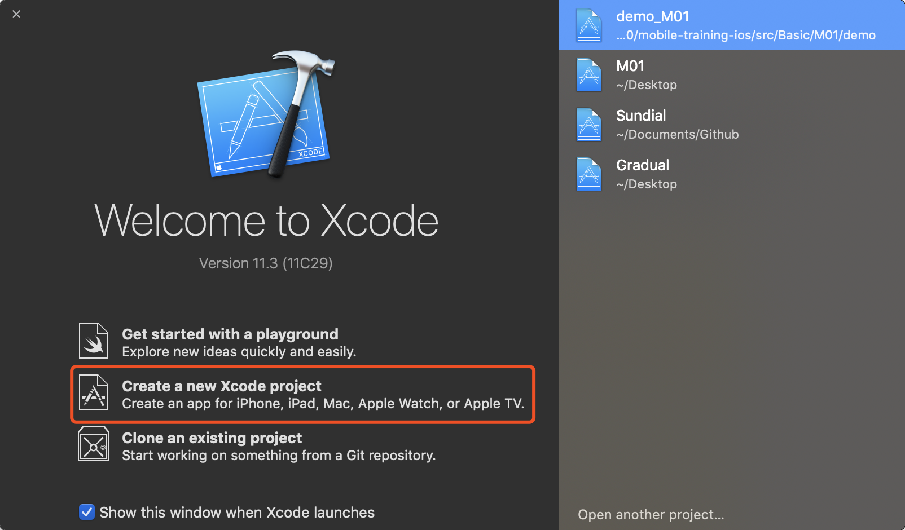
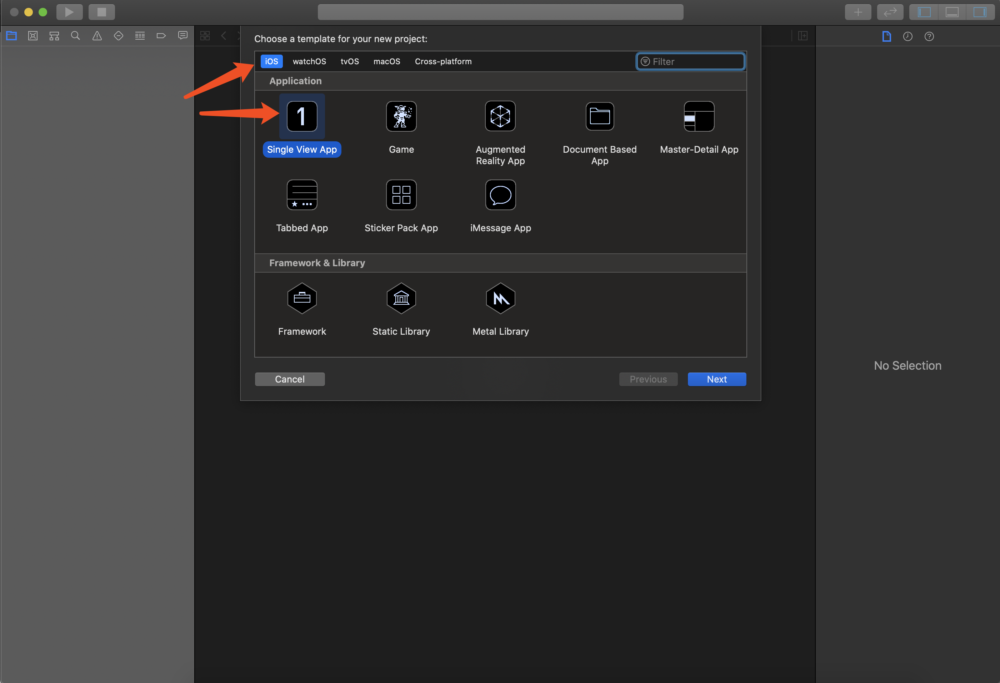

# Intro to Xcode

The Xcode provide everything you need to develop an iOS application.

In this session, we will walk through a demo project in `./demo` to learn basic usage.

## Walking through the Xcode

### Run the demo app

- Download Xcode from App Store
- Open the demo project from this repo

```sh
cd M01/demo
open . # then right click on the .xcodeproj file to load with a specific version of Xcode
```
<!-- *NOTE: make sure you open the workspace file, not the project file* -->

- Build and run the app from Xcode
- Features of the app, seen in the simulator:

### The anatomy of an app
- an app is a bundle of compiled code (usually Swift), images and other resources
  - zipped up and deployed through the app store
- these bundles are represented by a target in Xcode

### Project structure

- Project Targets - App, Unit Tests and UI Tests targets
- Folder structure - App, Unit Tests and UI Tests
- Schemes - a way to compile and run a target
- Run the app vs running the tests

### App lifecycle
- Breakpoints: Breakpoints and Check the stack trace in Xcode
- AppDelegate: Centre point for the app lifecycle
- UIViewController: Represents part of a screen

### More Xcode features
* Navigators (left panel) - different views on the your project, like files, issues, tests, breakpoints
* Inspectors (right panel): File Inspector, Help Inspector, more on Interface Builder session.
* Output (bottom panel) - see debug output and the actual debugger



## Exercise: create a new project

### Getting started with a new project

* In Xcode, choose `File > New > Project`
* Create a Single View Application, as show below
* Give the project a name, organisation and check the unit tests box (more on this in another session)




