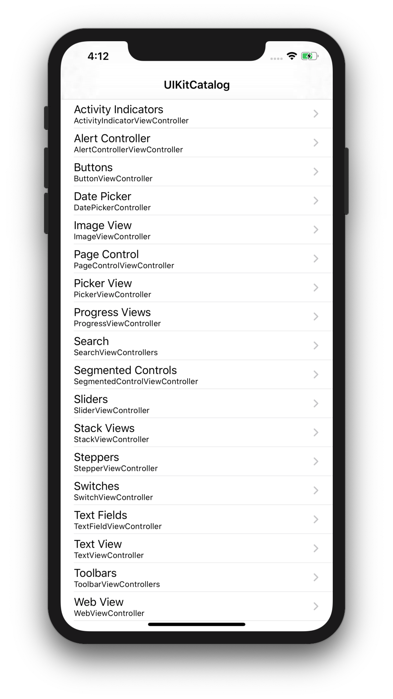
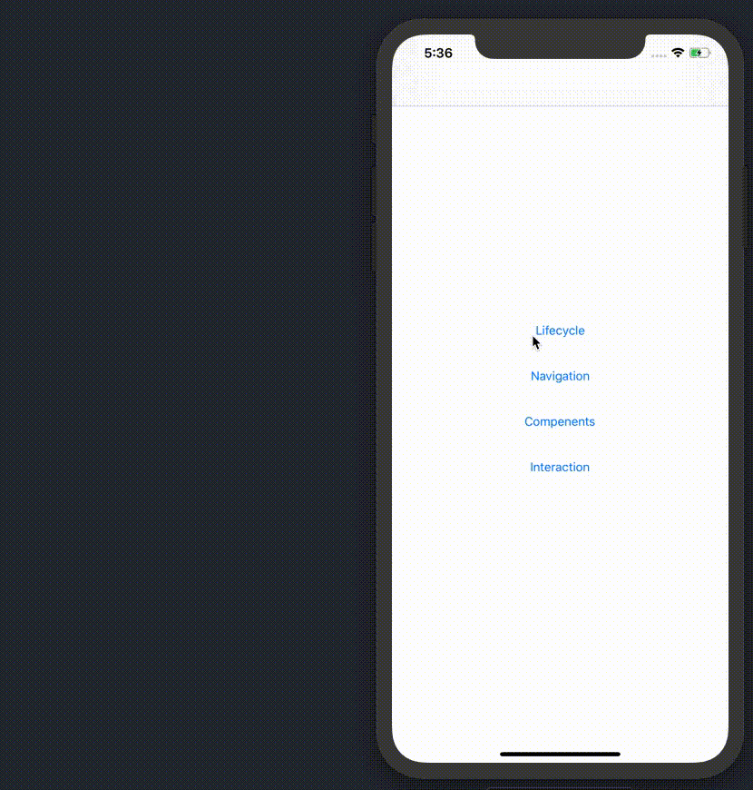
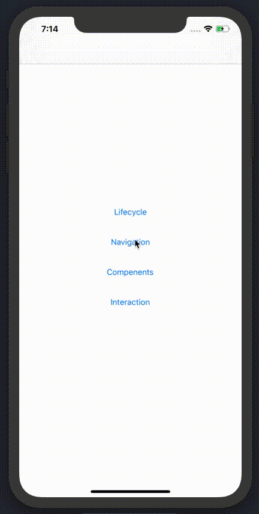
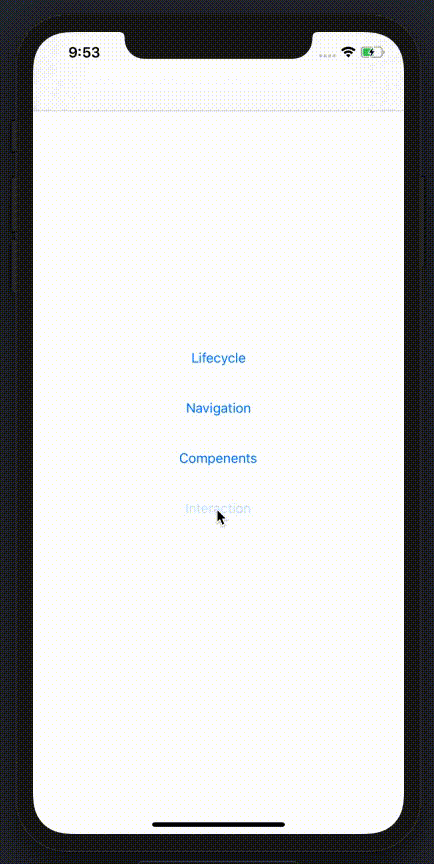

# Intro to UIKit

The UIKit framework provides the core objects that you need to build apps for iOS and tvOS. You use these objects to display your content onscreen, to interact with that content, and to manage interactions with the system. Apps rely on UIKit for their basic behavior, and UIKit provides many ways for you to customize that behavior to match your specific needs.

In this session, we will learn about:
- Walking through the UIKit Catalog
- The lifecycle of `UIViewController`
- Navigation
- Commonly used components
- Using `UIGestureRecognizer` to interact with content

### Walking through the UIKit Catalog

Apple provides a sample application that showcases some of the commonly used UIKit views and controls. 
[Download It](https://developer.apple.com/documentation/uikit/views_and_controls/uikit_catalog_creating_and_customizing_views_and_controls)

In the UIKit catalog, we will see some commonly UI components, we don't need to coding every components in there for now, but we need to know what thing a component could do.

### The lifecycle of `UIViewController`
View controllers go through many stages over their lifetime, and we may need to respond to some of them. View controller will automatically call its own functions when a lifecycle event occurs so that subclasses override the methods to react to changes.

1. Open `UIKitDemo` and find `LifeCycle` folder, there are two view controllers, each view controller will print out it's lifecycle events. the lifecycle events as follow:
    - viewDidLoad
    - viewWillAppear
    - viewDidAppear
    - viewWillDisappear
    - viewDidDisappear

2. Run `UIKitDemo` and click `LifeCycle` button, then forward and back between green and red view controller, there are some lifecycle events log printed in the console.

    - What is the order of printed events?
    - Is there a relationship between events?

### Navigation
The most common navigation patterns in iOS are：

- Modally present and
- Stack-based push and

we will practice it in demo, after you finishe to TODOs, think about:
- After you present `GreenViewController` in demo, when click `Foward to red` button, why red view controller is presented, not pushed ?
- What is `UINavigationController`?

### Most commonly used components

- UIView
- UIButton
- UILabel
- UITextField
- UIImageView
- ..

The demo has implement `UIView` as an example, we will practice the left components in the demo.

### Using `UIGestureRecognizer` to interact with content
Commonly used gestures:
- Tap
- Pan
- Swipe
- Pinch
- Rotation
- Long Press

The demo has implement `Tap` as an example, we will practice the left gestures in the demo.

## Further reading

- [View Controller Programming Guide for iOS](https://developer.apple.com/library/archive/featuredarticles/ViewControllerPGforiPhoneOS/index.html)
- [Using Responders and the Responder Chain to Handle Events](https://developer.apple.com/documentation/uikit/touches_presses_and_gestures/using_responders_and_the_responder_chain_to_handle_events)