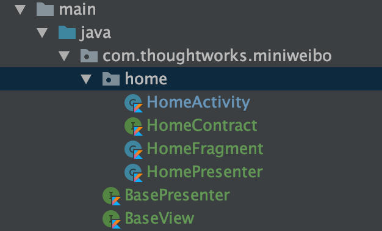

# Weibo Workshop Preparation

## Story

#### Context

When we start a new project, most of time we will create Iteration 0 to setup the project structure.

#### Scope

* Project init
* Mock server setup
* Add 3rd Library

#### Acceptance Criteria

| Given | When | Then |
| :--- | :--- | :--- |
| I am a developer | I use Xcode import the project | I can see the main project already set up done, and there is a AppDelegate |
| I am a developer | I use the command line tool start the mock server | I can see the http server has been started |
| I am a developer | I use Xcode import the project | I can see the MVVM architecture already set up |
| I am a developer | I use Xcode import the project | I can see the project tests & project UITests already set up |
| I am a developer | I use Xcode import the project | I can see the network connectivity already set up |

## Create the iOS Project

Use `Single View App` and `Storyboard` create the project:

* __Name__: Mini weibo
* __Bundle identifier__: com.thoughtworks.miniweibo
* __Language__: Swift
* __Target version__: iOS 10.0

After project created, you can use git init a repository, then add your first commit.

> Tips: If you choose xcode to automatically create a git repository, just commit.

## Mock
In `src/Basic/project/MiniWeibo/Mock` already create the node version mock server, in session you can use this mock server.
You'd better study the Node.js session, create your own server.

## Add MVVM Architecture

When build the real application, we can't put every code into ViewController class, so we need add the design pattern in our project.

* [iOS Architecture Samples](https://github.com/tailec/ios-architecture)
* [Model–view–presenter](https://en.wikipedia.org/wiki/Model–view–viewmodel)

<!-- Add BaseView.kt and BasePersenter.kt in package `com.thoughtworks.miniweibo`
And also refactor the MainActivity to:

 -->

## Add 3rd Libraries

iOS application usually use the following tools to manage third-party libraries. You can choose a suitable one from below to use.

#### Carthage

[Configure your Carthage](https://github.com/Carthage/Carthage)

#### Cocoapods

[Configure your Cocoapods from homepage](https://cocoapods.org/)  
[Learn more from Github](https://github.com/CocoaPods/CocoaPods)  

#### _Swift Package Manage(AKA SPM or SwiftPM)_

[Configure your Swift Package Manager from homepage](https://swift.org/getting-started/#using-the-package-manager)  
[Learn more from Github](https://github.com/apple/swift-package-manager)

## Q&A

- Why should I use Cocoapods, Carthage & SPM? What's wrong with just copy the source code inside my iOS project and use that?”
- What is the difference between Cocoapods, Carthage, SPM?

## Network

In this session demo, we use the URLSession to send the HTTP request. You can also use 3rd part library like [Alamofire](https://github.com/Alamofire/Alamofire), which is using abstract away access to URLSession.

The URLSession demo code you can refer [HttpRequest](https://github.com/tw-mobile-chengdu/mobile-training-ios/blob/master/src/Basic/project/MiniWeibo/MiniWeibo/Classes/Request/HttpRequest.swift).

## Testing

For iOS unit test, apple provide us the framework called [XCTest](https://developer.apple.com/documentation/xctest), in the most project we use behavior-driven development framework like [Quick](https://github.com/Quick/Quick) and use [Nimble](https://github.com/Quick/Nimble) as our test matcher.

## Further Reading

- [Programmatically Creating Constraints](https://developer.apple.com/library/archive/documentation/UserExperience/Conceptual/AutolayoutPG/ProgrammaticallyCreatingConstraints.html#//apple_ref/doc/uid/TP40010853-CH16-SW1)

  
  
  

