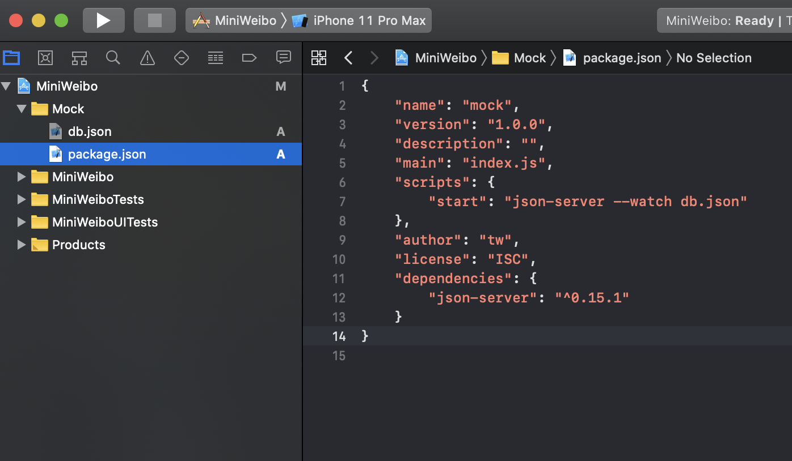
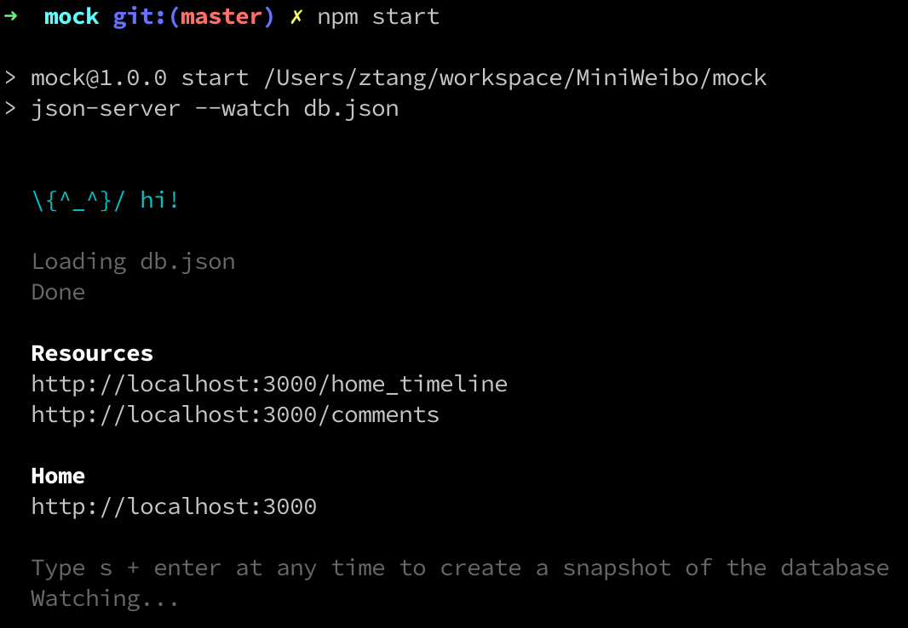
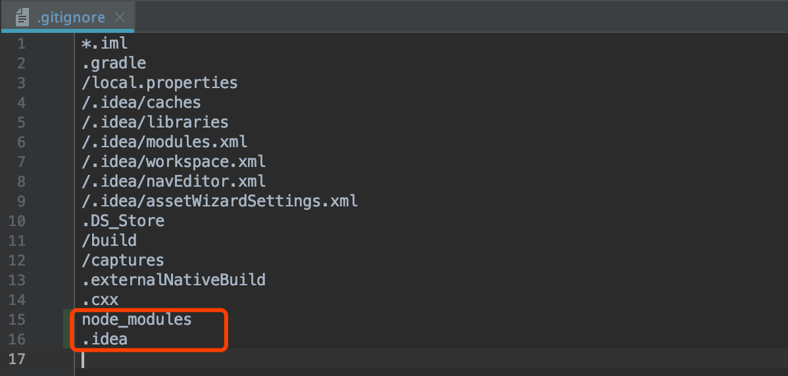

# Weibo Workshop Preparation

## Story

#### Context

When we start a new project, most of time we will create Iteration 0 to setup the project structure.

#### Scope

* Project init
* Mock server setup
* Add 3rd Library

#### Acceptance Criteria

| Given | When | Then |
| :--- | :--- | :--- |
| I am a developer | I use Xcode import the project | I can see the main project already set up done, and there is a AppDelegate |
| I am a developer | I use the command line tool start the mock server | I can see the http server has been started |
| I am a developer | I use Xcode import the project | I can see the MVVM architecture already set up |
| I am a developer | I use Xcode import the project | I can see the project tests & project UITests already set up |
| I am a developer | I use Xcode import the project | I can see the network connectivity already set up |

## Create the iOS Project

Use `Single View App` and `Storyboard` create the project:

* __Name__: Mini weibo
* __Bundle identifier__: com.thoughtworks.miniweibo
* __Language__: Swift
* __Target version__: iOS 10.0

After project created, you can use git init a repository, then add your first commit.

> Tips: If you choose xcode to automatically create a git repository, just commit.

## Create Mock Server

Most the mobile app will use the HTTP/HTTPS protocol to communicate with the server, we will setup a mock server to help us do the app develop:

* setup mock server because sometime the server delivery with app at the same time, we can change our app point to local mock server, then you can start the develop/debug.
* we will setup the functional test for the app, we also need this mock server, it more stable then the real server.

There are a lot of mock server library, e.g. [mountbank](http://www.mbtest.org/), [nock](https://github.com/nock/nock). in this workshop we choose [json-server](https://github.com/typicode/json-server).

* Create a new group `mock`. and the create a new `Empty` file named package.json in your project.



* In terminal, cd to `mock` folder, run command `npm init`, every question you can keep default value.
* In terminal, run command `npm install json-server` to install node module.
* In `mock` folder, create new file `db.json`, and add some content.

```json
{
  "home_timeline": [
    {
      "created_at": "Tue May 31 17:46:55 +0800 2011",
      "id": 11488058246,
      "text": "求关注。",
      "reposts_count": 8,
      "comments_count": 9,
      "user": {
        "id": 1404376560,
        "screen_name": "zaku",
        "name": "zaku"
      }
    }
  ],
  "comments": [
    {
      "created_at": "Wed Jun 01 00:50:25 +0800 2011",
      "id": 12438492184,
      "text": "love your work.......",
      "user": {
        "id": 1404376560,
        "screen_name": "zaku",
        "name": "zaku"
      }
    }
  ]
}
```

* open the package.json file, in `scrips` setion add `start: "json-server --watch db.json"`.
* In termimal, run command `npm start` to start the mock server.
* Then you can see the mock server info in terminal:



* Add `node_modules` into `.gitignore`, then add a new git commit.



>Tips:
>* Use google search to setup the Node environment in you local machine.
>* Use google search to get some HTTP/HTTPS document to read.

## Add MVVM Architecture

When build the real application, we can't put every code into ViewController class, so we need add the design pattern in our project.

* [iOS Architecture Samples](https://github.com/tailec/ios-architecture)
* [Model–view–presenter](https://en.wikipedia.org/wiki/Model–view–viewmodel)

<!-- Add BaseView.kt and BasePersenter.kt in package `com.thoughtworks.miniweibo`
And also refactor the MainActivity to:

 -->

## Add 3rd Libraries

iOS application usually use the following tools to manage third-party libraries. You can choose a suitable one from below to use.

#### Carthage

[Configure your Carthage](https://github.com/Carthage/Carthage)

#### Cocoapods

[Configure your Cocoapods from homepage](https://cocoapods.org/)  
[Learn more from Github](https://github.com/CocoaPods/CocoaPods)  

#### _Swift Package Manage(AKA SPM or SwiftPM)_

[Configure your Swift Package Manager from homepage](https://swift.org/getting-started/#using-the-package-manager)  
[Learn more from Github](https://github.com/apple/swift-package-manager)

## Q&A

- Why should I use Cocoapods, Carthage & SPM? What's wrong with just copy the source code inside my iOS project and use that?”
- What is the difference between Cocoapods, Carthage, SPM?

## Further Reading

- [Programmatically Creating Constraints](https://developer.apple.com/library/archive/documentation/UserExperience/Conceptual/AutolayoutPG/ProgrammaticallyCreatingConstraints.html#//apple_ref/doc/uid/TP40010853-CH16-SW1)

  
  
  


