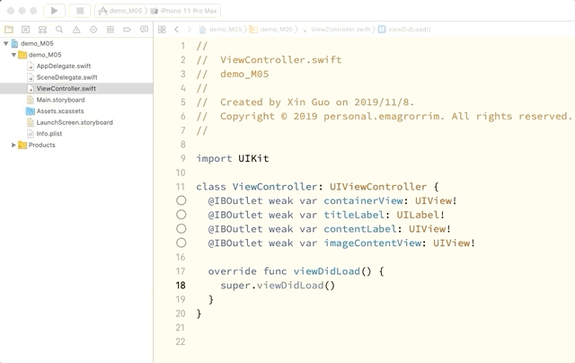
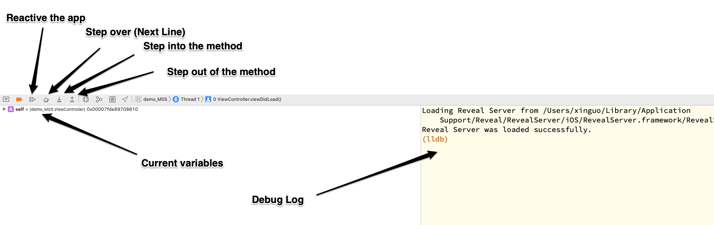
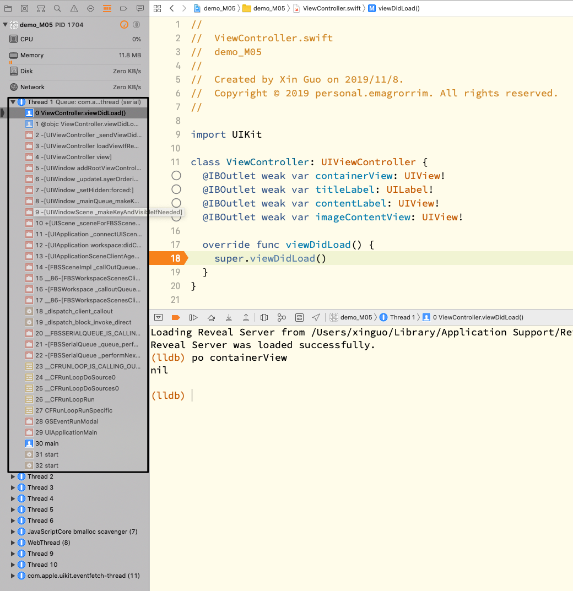
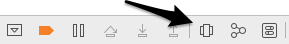

# Debugging

Debugging is something really important on all platforms and need to keep learning. Xcode provide bunch of tools to debugging. Eg. Breakpoints, Variable views, Callstack, Debugging console, Memory Graph and so on.

## Breakpoints

Breakpoints are some points app will stop running. And show the current state of the application. It's the most useful tool and used widely when we debug the app.

You can `add`, `deactive`, `active` and `remove` a breakpoint.

You can see the thing you want in following debug area. You can also ask the console to help you print some value of the variables you are intersted in.

## Callstack

The callstack is the the stack the method you add breakpoint is called from. It looks like the following image.

You can click every row in this stack, and see the related variables. And also you will know who call this method and why it is called.

## Visual debugging

When you are fixing the layout issue. You can use the integrated tools in Xcode, when your app is running and on the page you want to see the view hierarchy, you can press this key.

Then you should see the view hierarchy like following image

## Reference

Debugging with XCode
* https://developer.apple.com/library/archive/documentation/DeveloperTools/Conceptual/debugging_with_xcode/chapters/debugging_tools.html#//apple_ref/doc/uid/TP40015022-CH8-SW7

Advanced Debugging
* https://developer.apple.com/videos/play/wwdc2018/412

Visual Debugging with Xcode
* https://developer.apple.com/videos/play/wwdc2016/410/
* https://developer.apple.com/library/archive/documentation/DeveloperTools/Conceptual/debugging_with_xcode/chapters/special_debugging_workflows.html
