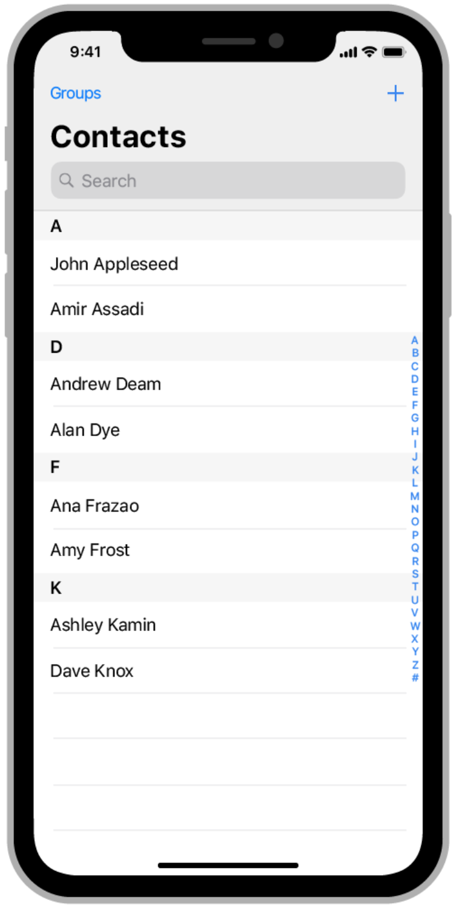
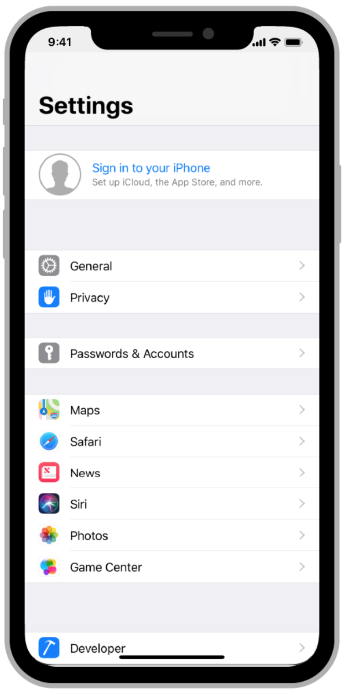
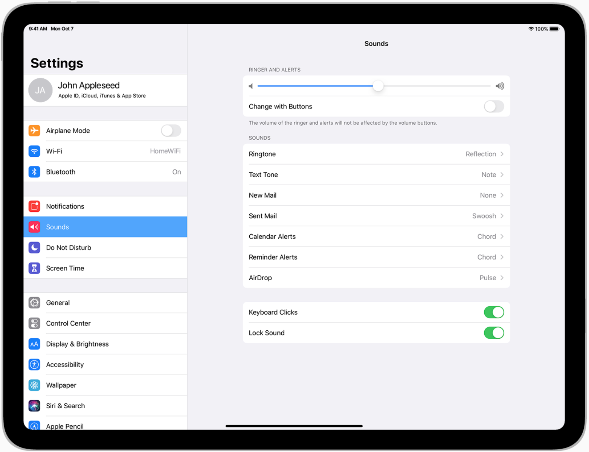
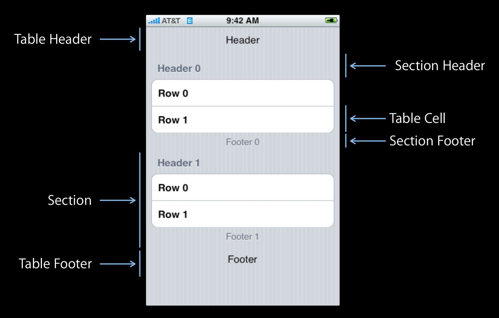
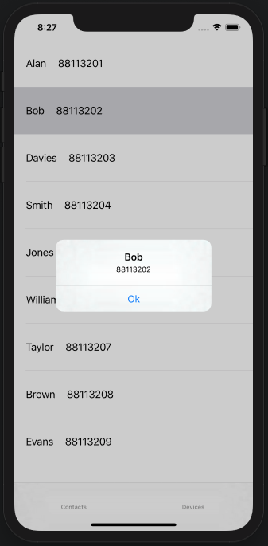

# UITableView

Table views present data as a scrolling, single-column list of rows that can be divided into sections or groups. Use a table view to display large or small amounts of information cleanly and efficiently in the form of a list.

### Style of UITableView
- **Plain**: Rows can be separated into labeled sections, and an optional index can appear vertically along the right edge of the table. A header can appear before the first item in a section, and a footer can appear after the last item

- **Grouped**: Rows are displayed in groups, which can be preceded by a header and followed by a footer. This style of table always contains at least one group and each group always contains at least one row. A grouped table doesn’t include an index.

- **Inset grouped**: *(Introduce in iOS13)*.
Rows are displayed in groups that have rounded corners and are inset from the edges of the parent view (as shown on the right of the image above). This style of table always contains at least one group and each group always contains at least one row and can be preceded by a header and followed by a footer. An inset grouped table doesn’t include an index. The inset grouped style works best in a regular width environment. Because there's less space in a compact environment, an inset grouped table can cause text wrapping, especially when content is localized.

### Anatomy of UITableView

- Table Header
- Sections
    - Section Header
    - Table Cells
    - Section Footer
- Table Footer

### Delegate & DataSource
- **UITableViewDelegate**: Manages selections, configuring section headers and footers, deleting and reordering cells, and performing other actions in a table view.

- **UITableViewDataSource**: Manages data and provide cells for a table view.
UITableViewDataSource protocol has two important methods that we **MUST** implement to populate data on the contactsTableView, they are *numberOfRowsInTableView* and *cellForRowAtIndexPath*.

### Exercise
1. Complete the TODO For exercise1 in `ContactsViewController` 

2. Implement the `DevicesViewController`
 Acceptance criteria:
    - has a header view above first `Android` or `iOS` device. the header view contains a label, the label text will be the platform name.
    - display name, system and available status in each device cell.
3. Reuse mechanism and load optimization of UITableView
Complete the TODO For exercise3 in `ContactsViewController`, what you have found? how to fix it?