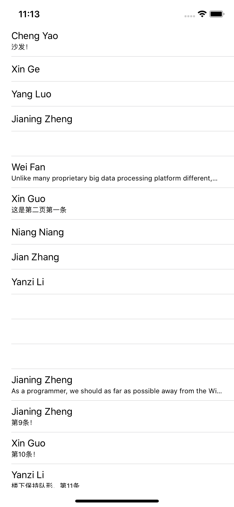

# Networking

## 1. [URLSession Tutorial: Getting Started](https://www.raywenderlich.com/3244963-urlsession-tutorial-getting-started)

Please follow the tutorial to learn URLSession, and finish the **Half Tunes** in tutorial.

## 2. Learn how to convert JSON to Object in Swift

Many programming tasks involve sending data over a network connection, saving data to disk, or submitting data to APIs and services. These tasks often require data to be encoded and decoded to and from an intermediate format while the data is being transferred.

The Swift standard library defines a standardized approach to data encoding and decoding. You adopt this approach by implementing the `Encodable`and `Decodable` protocols on your custom types. Adopting these protocols lets implementations of the `Encoder` and `Decoder` protocols take your data and encode or decode it to and from an external representation such as JSON or property list. To support both encoding and decoding, declare conformance to [`Codable`](https://developer.apple.com/documentation/swift/codable), which combines the `Encodable` and `Decodable` protocols. This process is known as making your types *codable*.

Simple Example:

We have a JSON structure

```json
{
  "name" : "John Appleseed",
  "id" : 7,
  "favoriteToy" : {
    "name" : "Teddy Bear"
  }
}
```

How can we convert it to Object in Swift?

```swift
struct Toy: Codable {
  var name: String
}
struct Employee: Codable {
  var name: String
  var id: Int
  var favoriteToy: Toy
}

let sameEmployee = try JSONDecoder.decode(Employee.self, from: data)
```

It's easy! Right?

For deep learning: [Encoding and Decoding Custom Types](https://developer.apple.com/documentation/foundation/archives_and_serialization/encoding_and_decoding_custom_types)

## 3. Challenge

There is a API: https://thoughtworks-mobile-2018.herokuapp.com/user/jsmith/tweets

Please implement a demo using network and codable, it should look like this:

