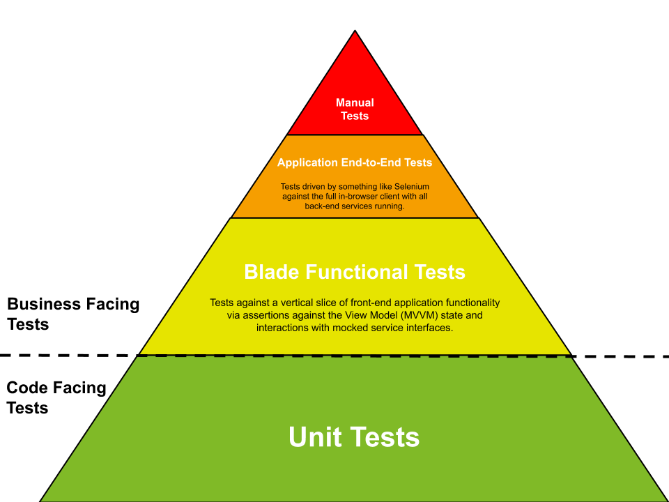
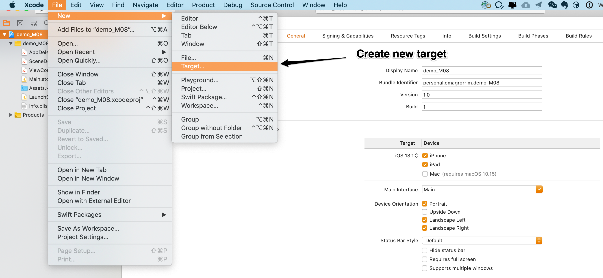
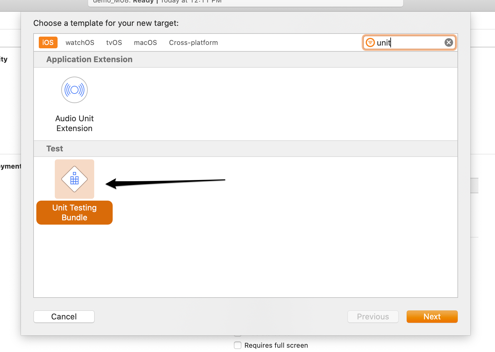
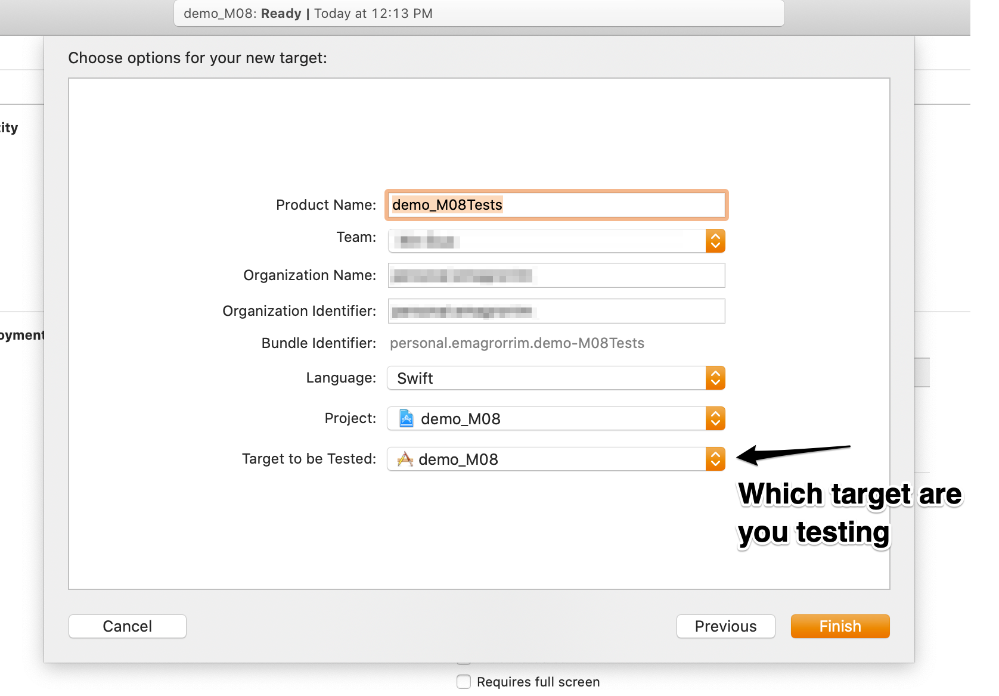
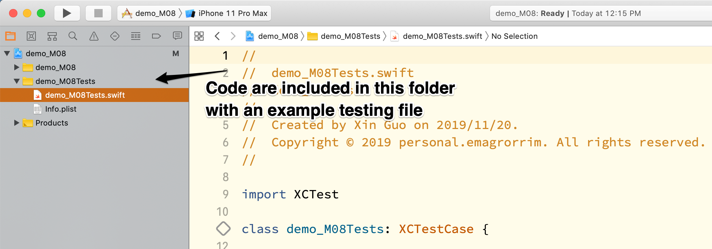
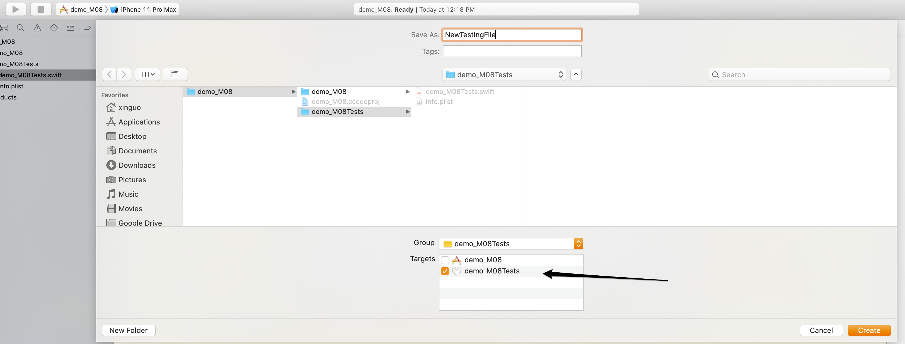
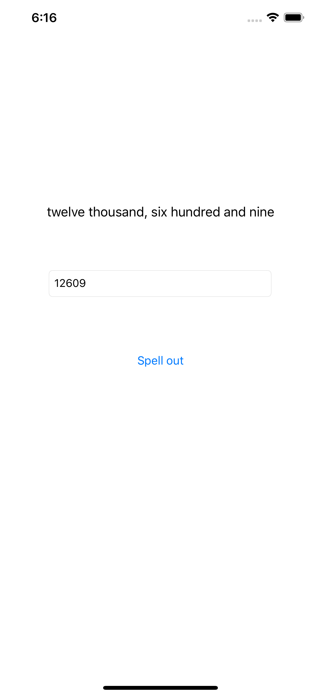

# Unit Testing

Include an introduction about doing the testing on iOS with Swift. We mainly using two testing frameworks - `Quick` and `Nimble`.

## Testing Triangle

There is a famous image called testing triangle which define the testing type and how much effort you need to test. Also you will know how much test you should add for each type of the testings.



As we can see, the manual testing is the most expensive testing method, so we should not add two many manual testing. And you can see for rest of the testings, they are cheaper and cheaper to test so you should add more of those type of testings.

And the unit testing is the testing facing the code, so devs add these testings to cover the function of the class rather than features. And there is a famous concept called TDD(Test Driven Development). You will use the unit testing to drive you writing the code. So we can make the code clean, easy to maintain, easy to refactoring and no overdesigned code.

## Unit Testing on iOS

As previous session mentioned, all the code should included in a target. So the first step should be create a target to contain these testing code. Create following code following the image.






And when you add more test files in the UT target, please remember to add the file to the target as the following image shown.



### Quick and Nimble

`Quick` and `Nimble` are two combined framework, the `Quick` is the testing framework which using `BDD` way to arrange its tests, and the `Nimble` is a function enhancment for `Quick`. For example:

```swift
import Quick
import Nimble

class TableOfContentsSpec: QuickSpec {
  override func spec() {
    describe("the 'Documentation' directory") {
      it("has everything you need to get started") {
        let sections = Directory("Documentation").sections
        expect(sections).to(contain("Organized Tests with Quick Examples and Example Groups"))
        expect(sections).to(contain("Installing Quick"))
      }

      context("if it doesn't have what you're looking for") {
        it("needs to be updated") {
          let you = You(awesome: true)
          expect{you.submittedAnIssue}.toEventually(beTruthy())
        }
      }
    }
  }
}
```

Here is the link of the Quick github repository and the document: https://github.com/Quick/Quick.

## Mock on iOS

*if you don know what is mocking, here is a ref: https://en.wikipedia.org/wiki/Mock_object*

The iOS testing(especially swift) doesn't support mocking very well. So we need more effort to do mocking when we write the unit tests. So there is one important thing when we write the unit tests on iOS which is `DI(Dependency Injection)`.

*Ref for DI: https://en.wikipedia.org/wiki/Dependency_injection*

## Exercise: number name

```
Spell out a number. For example

      99 --> ninety nine
     300 --> three hundred
     310 --> three hundred and ten
    1501 --> one thousand, five hundred and one
   12609 --> twelve thousand, six hundred and nine
  512607 --> five hundred and twelve thousand,
             six hundred and seven
43112603 --> forty three million, one hundred and
             twelve thousand,
             six hundred and three
```

Finish the function called `func numberName(of: Int) -> String` with tests to cover the possible senarios. And then shown on the iPhone screen.



Using the demo repo ([./demo/demo_M08](./demo/demo_M08)), the basic UI has been built, all you need to do you copy the demo app to any position in your laptop and finish the function in struct called `NumberNameSpeller`.

## References and reading

Documentation
* Apple's [Using Unit Testing](https://developer.apple.com/library/archive/documentation/ToolsLanguages/Conceptual/Xcode_Overview/UnitTesting.html) (although generally assume Apple engineers don't do a lot of testing)
* Apple's [XCTest docs](https://developer.apple.com/documentation/xctest), and the [actual source of XCTest](https://github.com/apple/swift-corelibs-xctest)
* [Quick](https://github.com/Quick/Quick) spec-style test runner libraru
* [Nimble](https://github.com/Quick/Nimble) expect matcher library

Books
* [Test Driven iOS Development with Swift](https://www.packtpub.com/application-development/test-driven-ios-development-swift-4-third-edition)
* Josh Brown's [Unit Testing in Swift](https://roadfiresoftware.com/unit-testing-in-swift/)
* Graham Lee's [Test-Driven iOS Development](https://www.oreilly.com/library/view/test-driven-ios-development/9780132764049/) (Objective C, a bit out of date)

Blogs & Tutorials
* [iOS Unit Testing and UI Testing Tutorial](https://www.raywenderlich.com/709-ios-unit-testing-and-ui-testing-tutorial)
* [Unit Testing on iOS](https://vimeo.com/channels/melbournecocoaheads/34321087) (out of date, just in case you want to laugh at when Stew had hair).
* Jon Reid's [Quality Coding](https://qualitycoding.org/) blog
* Krzysztof Zabłocki's [Testing iOS Apps](http://merowing.info/2017/01/testing-ios-apps/)
