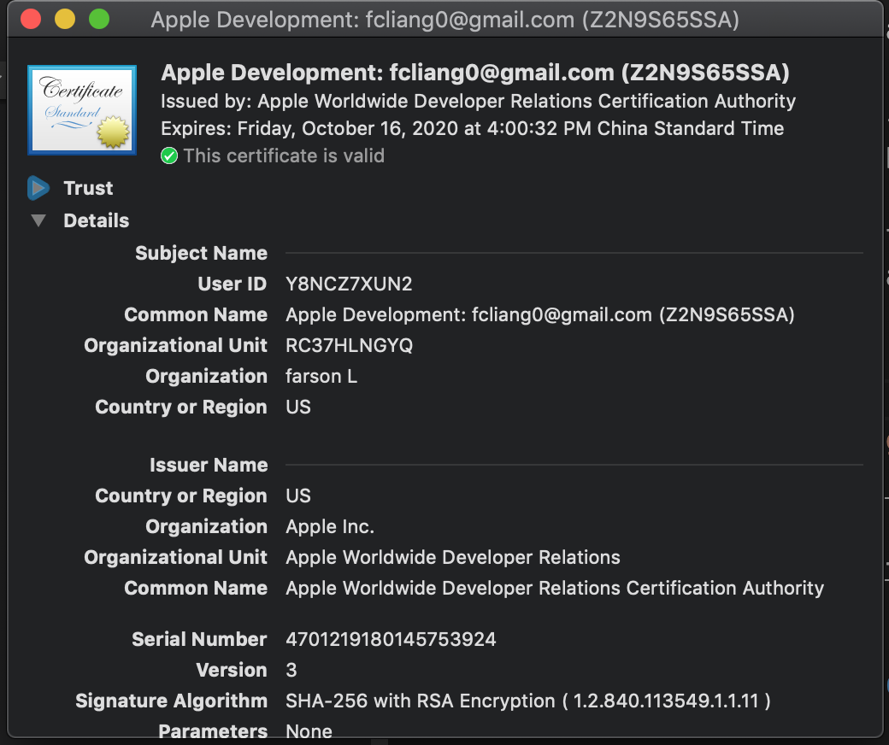
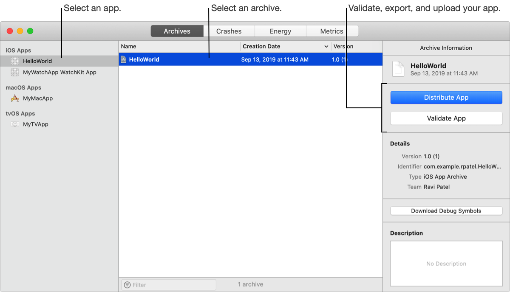

# Release

Once you have developed an iOS app, you’ll need to submit it to the App Store.

## Apple Developer ID

This identifier is associated with the app you want to sign and is required for creating the development provisioning profile that is created in the [Apple Developer portal website](https://idmsa.apple.com/IDMSWebAuth/signin?appIdKey=891bd3417a7776362562d2197f89480a8547b108fd934911bcbea0110d07f757&path=%2Faccount%2F&rv=1).

## Code Signing

Code signing your app assures users that it is from a known source and the app hasn’t been modified since it was last signed. Before your app can integrate app services, be installed on a device, or be submitted to the App Store, it must be signed with a certificate issued by Apple.

#### What is Code Signing

##### [What is a provisioning profile & code signing in iOS?](https://medium.com/@abhimuralidharan/what-is-a-provisioning-profile-in-ios-77987a7c54c2)

#### How to Generate a Code Signing Certificate

You'll need two kinds of files to sign your app: Certificates and Provisioning Profiles.

##### [Generating code signing files](https://ioscodesigning.com/generating-code-signing-files/)

#### Signing and Running Development Builds
1. Add your Apple ID to Accounts preferences
2. Assign the targets in your project to a team
3. Add capabilities to your app
4. Run your app on a device
5. Export your signing certificates and provisioning profiles

## Create an archive of your app
Create an archive of your app to upload it to App Store Connect or export it for distribution outside of the App Store.

1. In the main window, choose a target from the Scheme toolbar menu.
2. Choose Product > Archive.
3. If the archive builds successfully, it appears in the Archives organizer.
4. To open the Archives organizer, choose Window > Organizer and click Archives.

## Submit apps to the App Store

Every app that is submitted to the store has to be reviewed by the Apple team before release. The app needs to comply with all specified guidelines in order to be approved.

##### [App Store Review Guidelines](https://developer.apple.com/app-store/review/guidelines/)
##### [Distribute an app through the App Store](https://help.apple.com/xcode/mac/current/#/dev067853c94)
